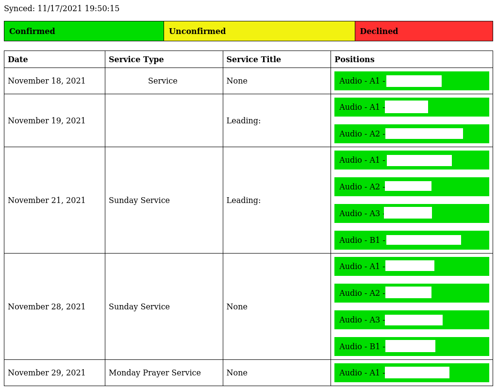

# services2image

Pull future dates from Planning Center to generate a schedule as an image file. This can be run as a cron job to update an image.

## Dependencies

Requires `wkhtmltopdf` command to be available.

## Usage

Include all positions

`PC_ID="applicationid" PC_SECRET="applicationsecret" ./services2image.py "" out.png`

Include only positions that have the word "audio"

`PC_ID="applicationid" PC_SECRET="applicationsecret" ./services2image.py audio out.png`

## Screenshot

